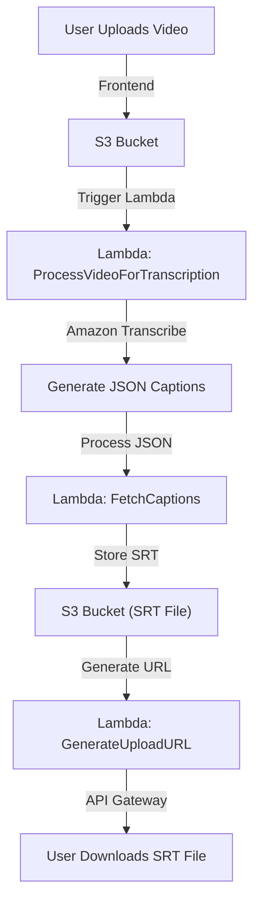

# Auto-Caption Generator for Videos

## 📌 Overview
The **Auto-Caption Generator** is a serverless application that automatically generates captions for uploaded videos using AWS services. It transcribes speech using **Amazon Transcribe**, converts it to **SRT format**, and allows users to download the captions via a web interface.

## 🎯 Features
✅ Upload video files through a simple frontend.
✅ Automatic transcription using **Amazon Transcribe**.
✅ Converts JSON transcription into **SRT format**.
✅ Secure pre-signed URLs for file upload and download.
✅ API Gateway integration for managing endpoints.

## 🛠️ AWS Architecture



## 📂 Project Structure
```
/auto-caption-generator
│── /frontend               # HTML, JavaScript for UI
│── /backend                # Lambda functions
│   ├── GenerateUploadURL/
│   ├── ProcessVideoForTranscription/
│   ├── FetchCaptions/
│── /screenshots            # Architecture and UI images
│── /scripts                # Deployment scripts (optional)
│── README.md               # Project documentation
│── .gitignore              # Ignore unnecessary files
│── requirements.txt        # Dependencies (if applicable)
```

## 🚀 How It Works
1️⃣ **Upload Video** – User uploads a video via frontend.  
2️⃣ **Transcription Starts** – Video is stored in S3, triggering a Lambda function.  
3️⃣ **JSON to SRT Conversion** – Another Lambda function processes the transcription.  
4️⃣ **Download Captions** – User retrieves the SRT file via API Gateway.

## 🔗 API Endpoints
| Action | Method | Endpoint |
|--------|--------|------------|
| Upload Video | PUT | `/upload` |
| Get Transcription Status | GET | `/transcription-status?file={filename}` |
| Download SRT File | GET | `/download-srt?file={filename}` |

## 🖼️ Screenshots
### **Architecture Diagram**


### **Frontend Upload Page**


## 📹 Video Demo
[](https://www.youtube.com/watch?v=YOUR_VIDEO_ID)

## 🛠️ Technologies Used
- **Amazon S3** – Stores videos and captions
- **AWS Lambda** – Handles processing tasks
- **Amazon Transcribe** – Converts speech to text
- **API Gateway** – Manages API requests
- **IAM Roles & Policies** – Secure access management

## 📌 Next Steps
- [ ] Improve error handling
- [ ] Implement batch processing for large files
- [ ] Add support for multiple languages

## 🤝 Contributing
Feel free to fork this repository, submit issues, or suggest improvements!

## 📝 License
This project is open-source under the MIT License.
