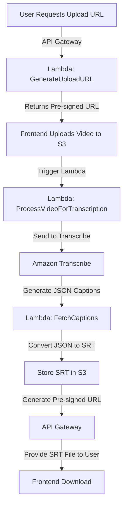
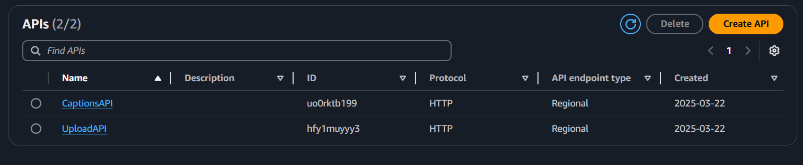
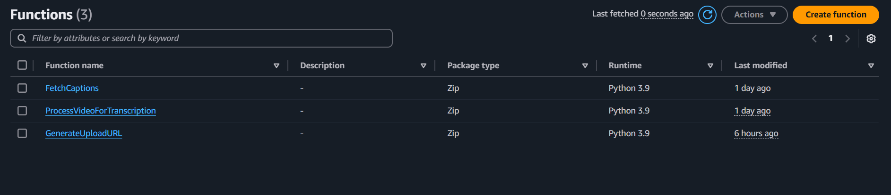
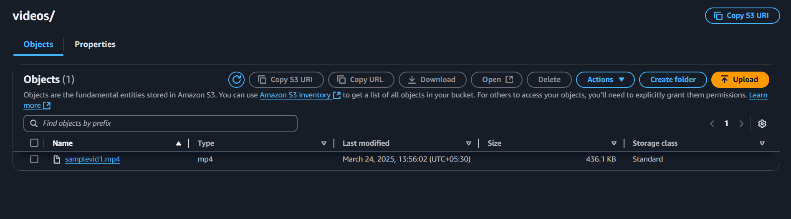
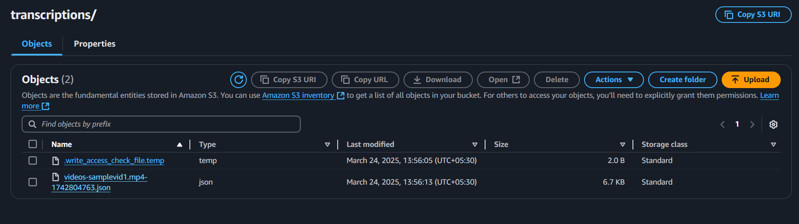
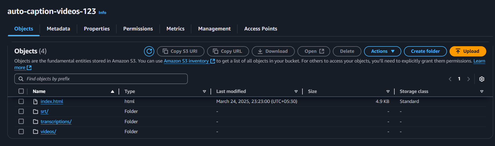
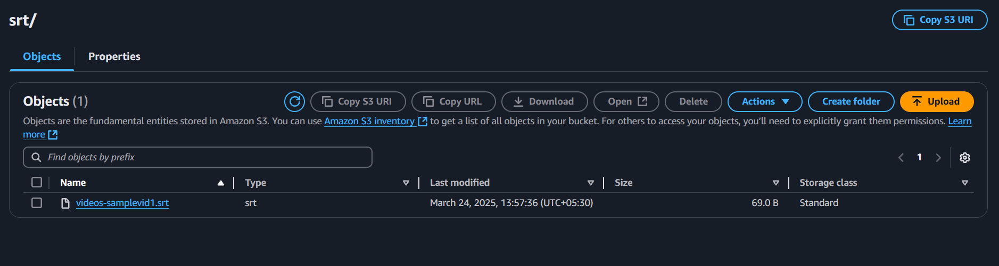
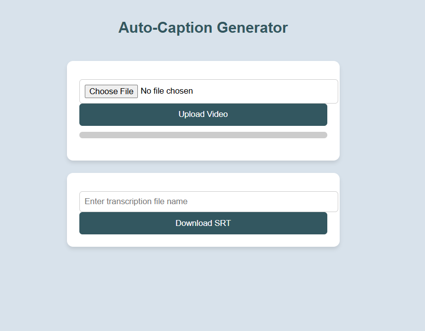

# Auto-Caption Generator for Videos

## 📌 Overview
The **Auto-Caption Generator** is a serverless application that automatically generates captions for uploaded videos using AWS services. It transcribes speech using **Amazon Transcribe**, converts it to **SRT format**, and allows users to download the captions via a web interface.

## 🎯 Features
✅ Upload video files through a simple frontend.
✅ Automatic transcription using **Amazon Transcribe**.
✅ Converts JSON transcription into **SRT format**.
✅ Secure pre-signed URLs for file upload and download.
✅ API Gateway integration for managing endpoints.

## 🛠️ AWS Architecture



## 📂 Project Structure
```
/auto-caption-generator
│── /frontend               # HTML, JavaScript for UI
│── /backend                # Lambda functions
│   ├── GenerateUploadURL/   # Handles secure video upload URLs
│   ├── ProcessVideoForTranscription/  # Initiates transcription
│   ├── FetchCaptions/       # Fetches and provides SRT files
│── /screenshots            # Architecture and UI images

```

## 🚀 How It Works
1️⃣ **Request Upload URL** – User requests a pre-signed URL for secure upload.  
2️⃣ **Upload Video** – The video is uploaded directly to S3.  
3️⃣ **Transcription Starts** – Video upload triggers a Lambda function.  
4️⃣ **JSON to SRT Conversion** – Another Lambda function processes the transcription.  
5️⃣ **Download Captions** – User retrieves the SRT file via API Gateway.

## 🔗 API Endpoints
| Action | Method | Endpoint |
|--------|--------|------------|
| Request Upload URL | GET | `/generate-upload-url` |
| Get Transcription Status | GET | `/transcription-status?file={filename}` |
| Download SRT File | GET | `/download-srt?file={filename}` |
## 🖼️ Screenshots
### **Architecture Diagram**

#### **1. API Gateway & Lambda**
  
The user requests an upload URL from the frontend, which triggers API Gateway through two API endpoints. This invokes a Lambda function that generates a pre-signed URL for uploading the video.

#### **2. Lambda Functions**
  
Lambda functions handle different stages of the process, including:  
- Generating pre-signed upload URLs  
- Processing uploaded videos  
- Fetching transcription results  
- Converting JSON captions into an SRT file  

#### **3. S3 Video Storage**
  
- Stores videos uploaded from webpage

#### **4. Transcription Process**
  
After a video is uploaded, an S3 event triggers a Lambda function that:  
- Processes the uploaded video  
- Sends it to Amazon Transcribe for speech-to-text conversion  

#### **5. S3 Generated Captions**
  
The S3 bucket structure includes:  
- `/videos/` → Stores uploaded video files  
- `/transcription/` → Stores transcription JSON files  
- `/srt/` → Stores generated subtitle (SRT) files  
- `index.html` → Frontend webpage for user interaction


#### **6. SRT File Storage**
  
A Lambda function converts the JSON captions into an SRT file, which is stored under:  
- `/srt/{filename}.srt`  

#### **7. Frontend Web Page**
  
The frontend allows users to:  
- Upload videos  
- Enter the filename to retrieve the generated SRT file  
- Use API Gateway to fetch the SRT file via a pre-signed URL  


## 🛠️ Technologies Used
- **Amazon S3** – Stores videos and captions
- **AWS Lambda** – Handles processing tasks
- **Amazon Transcribe** – Converts speech to text
- **API Gateway** – Manages API requests
- **IAM Roles & Policies** – Secure access management
